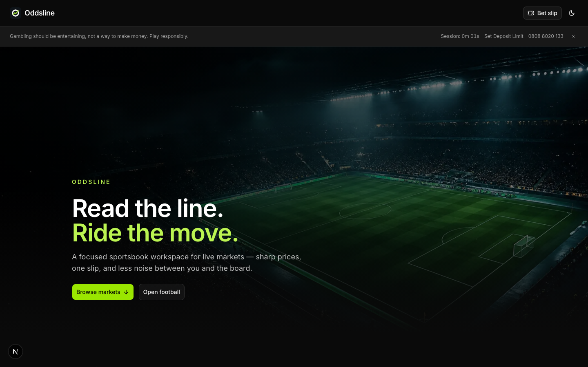
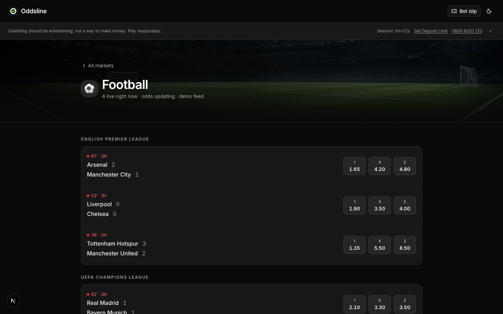
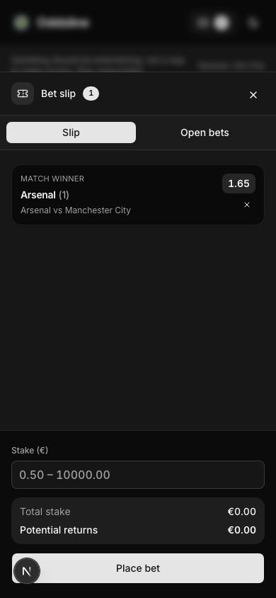

# Oddsline

Sportsbook UI for operators — lobby, live boards, bet slip, open tickets.

## Screenshots







## Branding


| | |
| --- | --- |
| **Mark** | O + lime sparkline on charcoal |
| **Wordmark** | “Oddsline” in Inter, next to the mark |
| **Ink** | `#0f1419` |
| **Lime** | `#a3e635` |
| **UI** | Dark by default · Inter · Geist Mono for numbers |

Lime is the accent (CTAs, live moments). Everything else stays quiet.

## Run

```bash
pnpm install
cp .env.example .env.local   # optional: THE_ODDS_API_KEY
pnpm dev
```

Live odds need a key from [the-odds-api.com](https://the-odds-api.com). Without it, mock data + simulated prices.

Bets: `POST/GET /api/bets` (local file store).

## Stack

Next.js 16 · React 19 · TypeScript · Tailwind · TanStack Query · Zustand · Zod
